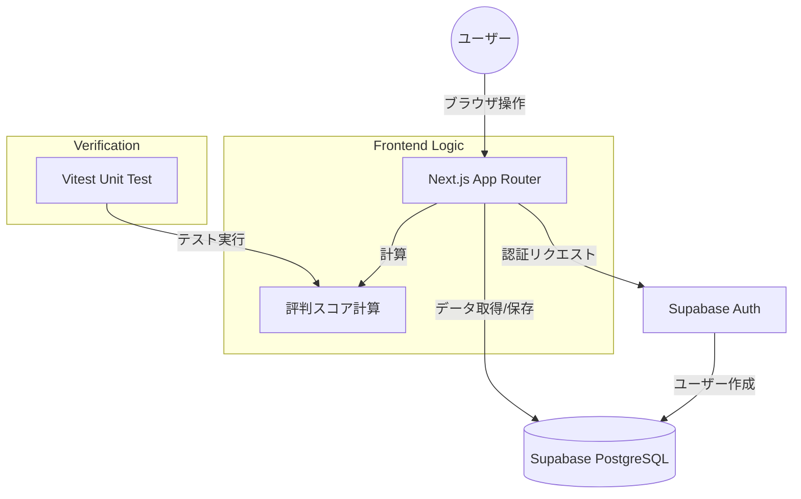
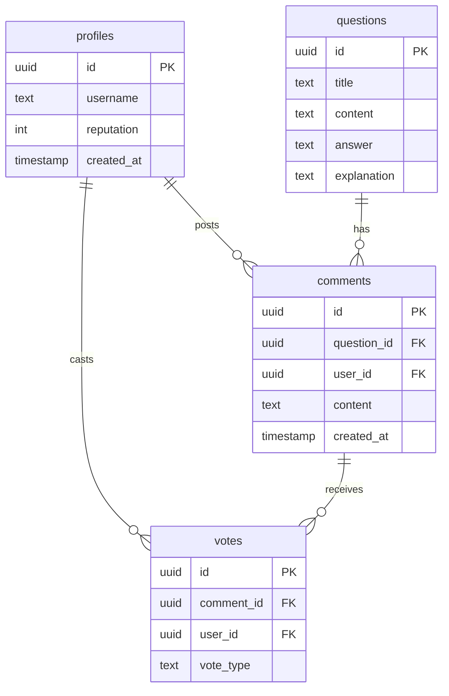

# システムアーキテクチャ

## データフロー図

```mermaid
graph TD
    User((ユーザー))
    NextJS[Next.js App Router]
    SupabaseAuth[Supabase Auth]
    SupabaseDB[(Supabase PostgreSQL)]
    Vitest[Vitest Unit Test]

    User -->|ブラウザ操作| NextJS
    NextJS -->|認証リクエスト| SupabaseAuth
    NextJS -->|データ取得/保存| SupabaseDB
    SupabaseAuth -->|ユーザー作成| SupabaseDB
    
    subgraph "Frontend Logic"
        NextJS -->|計算| ReputationLogic[評判スコア計算]
    end

    subgraph "Verification"
        Vitest -->|テスト実行| ReputationLogic
    end
```

## テーブル構成とリレーション

```mermaid
erDiagram
    profiles ||--o{ comments : "posts"
    profiles ||--o{ votes : "casts"
    questions ||--o{ comments : "has"
    comments ||--o{ votes : "receives"

    profiles {
        uuid id PK
        text username
        int reputation
        timestamp created_at
    }
    questions {
        uuid id PK
        text title
        text content
        text answer
        text explanation
    }
    comments {
        uuid id PK
        uuid question_id FK
        uuid user_id FK
        text content
        timestamp created_at
    }
    votes {
        uuid id PK
        uuid comment_id FK
        uuid user_id FK
        text vote_type
    }
```
